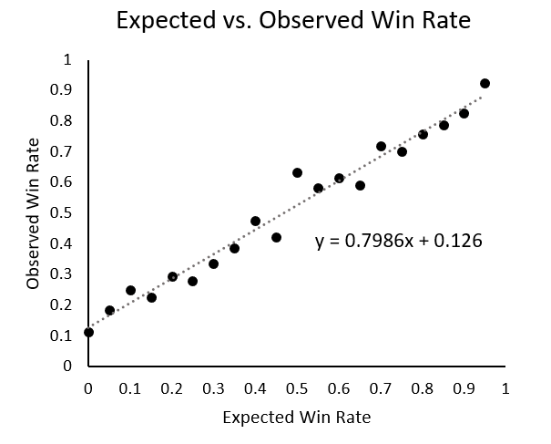

Teams play meaningful matches in third-party events throughout the year. To reduce the burden on Major participants and streamline the Major qualification process, we’re going to leverage those match results to identify teams that should be invited to later qualification stages. 

Our goals for the resulting Regional Standings are that they are accurate, not easily gamed, and have a transparent process.

## Regional Standings

We will use the Regional Standings to invite teams to future events, so the ideal model is one that predicts future match results. To that end, the current model incorporates the following factors:

1.	Team’s
    -	Prize money earned
2.	Beaten opponent’s
    -	Prize money earned
    - 	Number of teams beaten
3.	Head-to-head results

We know you’re interested in more details. In the coming weeks, this repository will host the actual code used to generate the standings along with a sample dataset.

## Invitations

We will update the standings periodically up until the open qualifiers. These final standings will determine which teams get invited to the closed qualifiers. All other teams will need to compete in the open qualifiers to secure their spot.

The current standings can be found here:
-   [Europe](standings_europe.md)
-   [Americas](standings_americas.md)
-   [Asia](standings_asia.md)

## Evaluating the Model

The approach we’re taking to evaluate the accuracy of our model is to measure the relationship between the expected and observed win rates in matches.

We run through each week of matches in our dataset and assign point values to the teams using the preceding week’s Regional Standings. Using the difference in point values, each match is then assigned an expected win rate. We break those win rates down into 5% bins, and then measure the actual win rates for matches that fall within each bin.

Here’s how the expected vs. observed win rates look when we go through this process with the current model:

 
There’s a strong relationship between expected and observed win rates. The correlation between the two (Spearman’s rho in this case) is 0.98. But the slope is shallower than we’d like--in an ideal world, the slope of this line would be closer to 1. The current model tends to underestimate win rates at the low end and overestimate at the high end. 

We think that this is a good starting point. 

## Updating and Improving the Model

The model we’re shipping today is the one we will use through the next Major. We’re going to keep experimenting, and we think you should too. After we ship the code and data to this repository, feel free to tinker and make something new. As long as your model does well and fits our goals, we’d be happy to consider it.